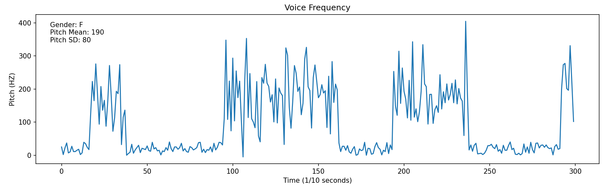
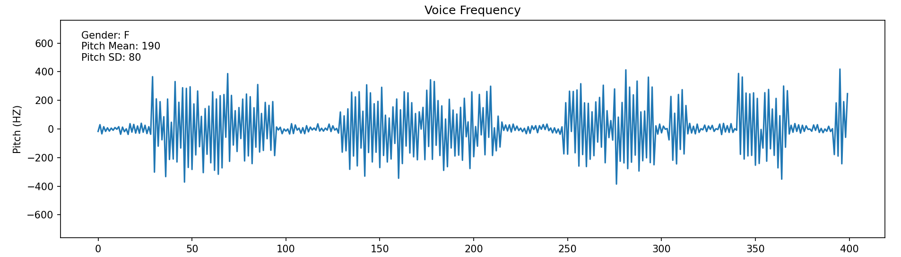
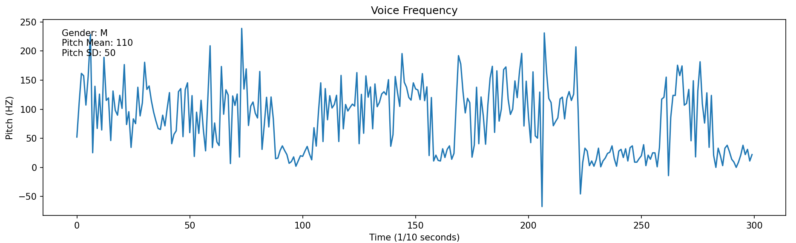

<h1 align='center'>Voice Data Generator</h1>

<div align='center'>
  
    
</div>

<div align='center'>
   <image src="banner.png" style="width:50%">
</div>

Voice Data Generator is a Python tool for simulating voice data with customizable parameters such as pitch, duration, and noise. This tool is designed for various applications, including speech analysis, machine learning training data generation, and audio signal processing experimentation.

## Features

- Generate synthetic voice data with specified pitch, duration, and noise levels.
- Visualize generated voice frequency patterns using matplotlib.
- Easily customizable parameters for different voice characteristics and analysis needs.
- Broadcast the talking flow in command line.

## Usage

- Install the required dependencies:

```bash
   pip install numpy matplotlib
```

- Clone the repository:

```bash
   git clone https://github.com/Dongli99/PY-voice-data-generator.git
```

- Navigate to the project directory:

```bash
cd PY-voice-data-generator.git
```

- Run the example script:

```bash
python main.py
```



- Use generator as an external library:

```bash
import VoiceDataGenerator

voice_generator = VoiceDataGenerator() 
# parameters can be customized, see next section
data = voice_generator.data

# the output data is a numpy.ndarray.
print(type(data))
print(data.shape)

# the generator has a plot function
voice_generator.plot()
```

## Customize Settings

### Set VoiceDataGenerator

- `duration` (int, default=300): The duration of the voice data in 1/10 seconds.
- `gender` (str, default="M"): The gender of the voice data ('M' for male, all else will be treated as female).
- `noise` (int, default=40): The level of noise to be added to the voice data.
- `tune_pitch` (int, default=0): Adjustment to the mean pitch.
- `tune_pitch_sd` (int, default=0): Adjustment to the pitch standard deviation.
- `broadcast` (bool, default=False): If True, print the process of talking in command line.

#### Example 1

```python
voice_generator = VoiceDataGenerator(duration=400, gender="F")
voice_generator.plot()  # plot the data, reflection is shown in default
```



### Set Reflection on Plot

- reflection (bool, default=True): Whether to reflect the voice data around the x-axis.

#### Example 2

```python
voice_generator = VoiceDataGenerator()
voice_generator.plot(reflection=False)
```



### Broadcast the talk flow

- broadcast (bool, default=False): Print the process of talking in command line.

```python
voice_generator = VoiceDataGenerator(broadcast=True) 
voice_generator.plot()
```

```console
folder> python main.py
The Female talked for 3.5 seconds.
The Female kept silence for 1.8 seconds.
The Female talked for 3.3 seconds.
The Female kept silence for 2.2 seconds.
The Female talked for 1.8 seconds.
The Female kept silence for 4.5 seconds.
The Female talked for 1.5 seconds.
The Female kept silence for 5.2 seconds.
The Female talked for 5.2 seconds.
The Female kept silence for 1.0 seconds.
```
